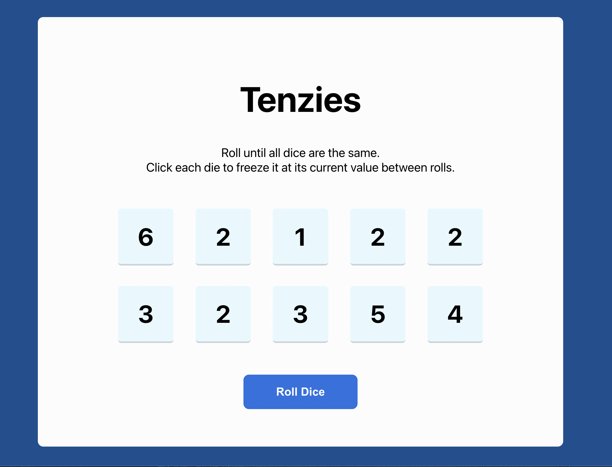
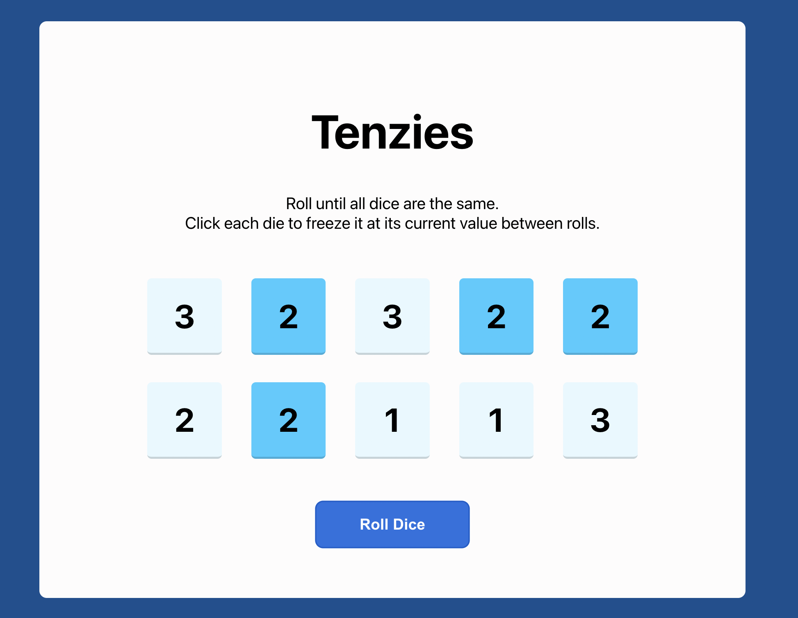
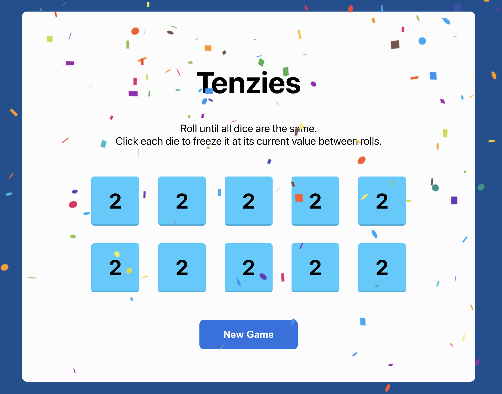

# Tenzies Game

Another exercise from Scrimba React course. Build a Tenzies Game.

This project was bootstrapped with [Create React App](https://github.com/facebook/create-react-app).

## Available Scripts

In the project directory, you can run:

### `npm start`

Runs the app in the development mode.\
Open [http://localhost:3000](http://localhost:3000) to view it in your browser.

The page will reload when you make changes.\

### `npm test`

Launches the test runner in the interactive watch mode.\
See the section about [running tests](https://facebook.github.io/create-react-app/docs/running-tests) for more information.

## Usage

When you open the app this is what you should see (dice have random values)

Follow instructions: click on same dice and then roll again.

When you win you should see this:

